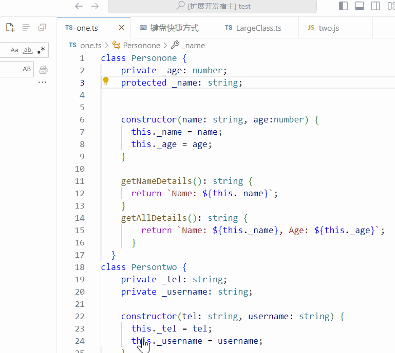
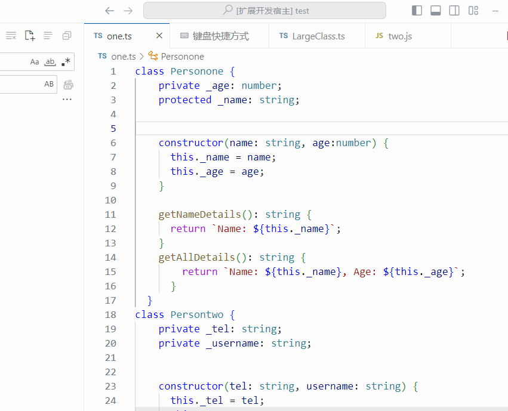
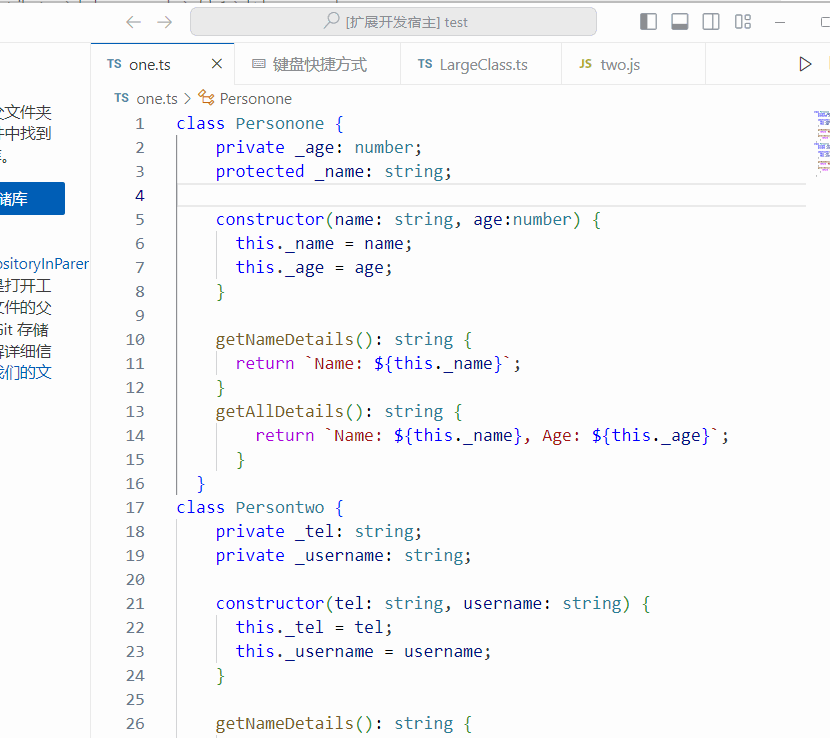

# Generate TS and JS Getters / Setters

## Existing functions:

1.Generate traditional object-oriented set and get methods or ES6 getter and setter functions for TS (TypeScript) and JS (JavaScript).

2.Can identify whether functions are duplicated and avoid generating functions repeatedly.

3.Can prompt for the absence of modifiers and the absence of the underscore ('_').

4.Can generate functions for a single property, a single file (all classes within the file), and for properties selected in the quick selection box.

## USE:

(The usage of JavaScript (JS) is the same as that of TypeScript (TS), so only the usage of TypeScript (TS) will be demonstrated.)

**For the traditional object-oriented writing method:**

+ Single property insertion function: Select a property and use generateGetterSetter or use the shortcut key Ctrl + Win + Shift + X.

+ File insertion function: Use generateGetterSetterForAll or use the shortcut key Ctrl + Win + Shift + Z.

+ Select property to generate function: Use SelectGSGenerate or use the shortcut key Ctrl + Alt + H.

**For ES6 accessor syntax:**

+ Single property insertion function: Select a property and use generateGetterSetterES6 or use the shortcut key Ctrl + Win + Shift + S.

+ File insertion function: Use generateGetterSetterForAllES6 or use the shortcut key Ctrl + Win + Shift + D.

+ Select property to generate function: Use SelectGSGenerateES6 or use the shortcut key Ctrl + Alt + G.

