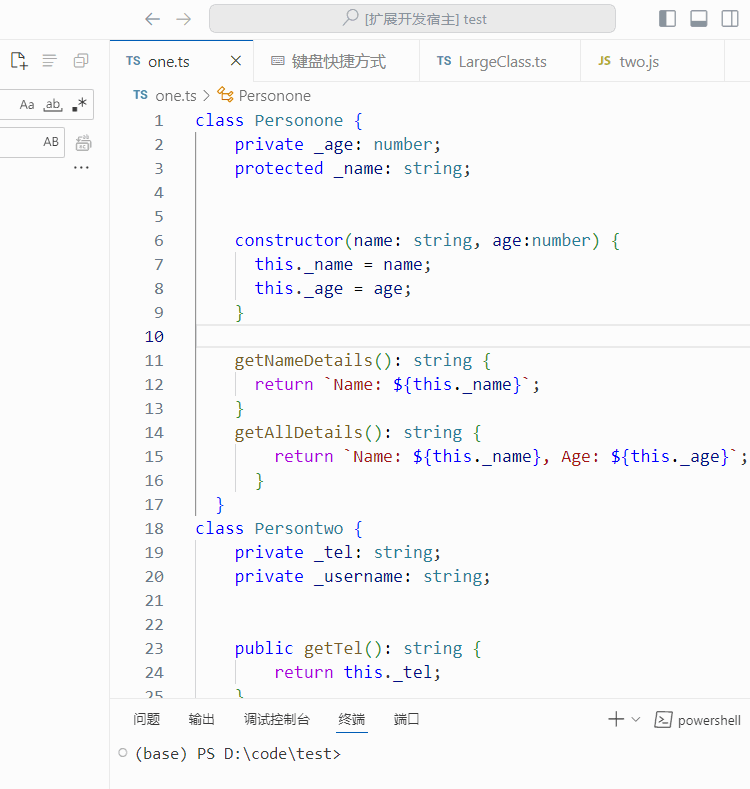

## 10.17
需求分析：该插件目标功能是实现get和set方法的注入，能够通过快捷键实现选中代码注入和全文档注入

阅读vscode插件开发文档，安装脚手架，搭建项目结构，尝试通过插件生成hello word

尝试通过插件对选中内容进行大小写转化
## 10.23
基本实现最初版本的编写，学习正则表达式，实现最基础的选中属性生成对应ts的set、get代码，将函数代码插入在属性的下一行

问题：插入位置不规范

遗留问题：如果属性和类型之间有换行，生成类型为空
## 10.28
在代码中加入js对应的生成代码

问题1：如果用户从constructor中选中内容插入，那么插入属性的下一行就会报错

问题2：插入位置难以确定，无法获得文件内容信息确定插入位置
## 10.29
尝试使用AST语法树拿到文件中所有类、方法、属性的位置，尝试将函数插入选中属性所在的下一个方法后

问题：需要对方法所在类进行判断，同时还要对属性所在位置进行判断
## 10.31
将set和get函数插入所属类的最后，避免位置不对而报错，同时还可以减少对方法所在类进行判断的过程

问题：如果已经存在函数生成代码，那么仍然再次生成，产生错误信息

---

## 11.2
**目标**：对现有插件的set、get生成函数进一步进行调查，确定其函数插入位置

**结果显示**：函数插入位置不固定，部分紧接着插入在变量后，部分插入在变量前（java），其中一个插件则通过**限制变量访问级别**实现对需要生成函数的变量限制，同时还能限制用户的不当操作，具有参考意义

**修改代码**:实现通过限制变量访问级别来对选中属性进行限制，并将函数代码插入类中最后属性的下一行
## 11.3
**实现**：修改AST代码，改为使用**ts-morph**，它提供了友好的API接口，可以轻松地访问和操作AST，完成各种类型的代码操作

**过程所遇问题**：对ts-morph所提供的接口不熟悉，查看文档后修改代码，使用ts-morph访问到类、属性的各种信息
## 11.5
**实现**：- 因为js中无法对属性使用public、private访问修饰符限制，再次对代码进行修改调整，

- 配置对应的vscode快捷键

**过程所遇问题**：js使用#对属性进行限制，ts-morph获取的属性包含#，使用正则表达式去#

**结果**：基本实现对选中属性的get、set函数代码生成，但其中对ts的代码规范性要求较高，js则较低
## 11.6
**实现**：- 实现对**单个文件**中包含的所有属性生成get、set函数
- 配置对应的vscode快捷键

**过程所遇问题**：
- 因为要将函数插入所在类的最后一个属性的下一行，对于这个行号的存储产生了疑问，最后确定为存储在类层级，可以减少返回的数据
- 对ts-morph所提供的API不熟悉，获取ts代码中属性的类型时拿到的不符合预期

**结果展示**：

单个属性插入函数：

文件插入函数：

---

## 11.7
**实现**：实现单个文件内所有属性生成的访问修饰符限制问题（针对TS）：有访问修饰符的属性则生成set、get函数代码；没有的属性则单独进行提示，不生成代码。

## 11.10
**实现**：修改单个属性生成函数的属性名称、类型等获取方法。同时解決了前面的遗留问题，如换行后无法获取属性类型等等。

## 11.11
**实现**：完善函数逻辑以及功能拆分。

## 11.13
**问题1**：文件内属性位置没有及时更新。

**解决**：在插入代码后对当前文件进行保存。

**问题2**：如果已经生成了函数，仍然会再次生成函数。

**解决**：在返回生成的get、set函数前，对方法进行判断，查看该方法是否已存在。

## 11.17
**解决**：完善避免重复生成函数的解决办法。

## 11.19
**实现**: 实现在快速选择框中选择多个想要生成函数代码的属性，生成对应的get、set函数。

选中属性生成函数：

---

## 11.22
对插件进行功能测试

## 11.26
对函数进行拆分重构

## 12.1
将生成面向对象的set、get函数改为访问器代码

**问题**：ts-morph的API中getMethods无法获取访问器方法，无法判断是否已生成函数。

**解决**：遍历类信息时使用getInstanceMembers获取所有实例成员，通过返回的成员的类型进行判断。

更改正则匹配代码，实现对js私有属性修饰符#的去除，在适时加入_。

